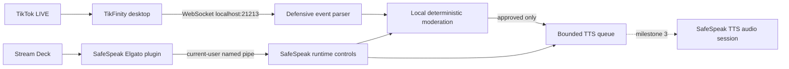

# Architecture

SafeSpeak keeps live content and control traffic on the streamer's Windows computer.

## Trust boundaries

- TikFinity input is untrusted. The client accepts only bounded text frames, tolerates unknown JSON fields, ignores non-chat events, and reconnects with capped backoff.
- Chat text is normalized before comparisons. The rule engine rejects disallowed scripts, mixed scripts, URLs, ineligible audiences, excessive frequency, and configured block terms.
- The local classifier contract fails closed when enabled but unavailable. No classifier model is bundled yet.
- Only approved text enters the bounded queue. Rejected text and usernames are not logged.
- The Stream Deck server uses a Windows named pipe restricted to the current user. Requests and responses are newline-delimited JSON with a small fixed command vocabulary.
- Disconnecting TikFinity disarms TTS. An emergency stop disarms TTS, disables automatic playback, and clears the queue.

## Projects

- `SafeSpeak.Core`: chat contracts, moderation, queue, and control protocol.
- `SafeSpeak.Infrastructure`: TikFinity WebSocket client, named-pipe server, and settings storage.
- `SafeSpeak.App`: WPF lifecycle, first-run accessibility prompt, status, and controls.
- `SafeSpeak.TikFinitySimulator`: local WebSocket fixtures for repeatable development.
- `streamdeck`: Elgato SDK plugin and protocol tests.

## Remaining release work

The WPF app currently routes approved TikFinity messages into the queue, but it does not speak them. Named audio-session output, immediate speech cancellation, ONNX model inference, editable policies, private screen-reader speech, diagnostics, packaging, and real-device acceptance testing remain separate milestones.
