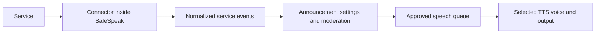

# Direct service connectors and TikTok feasibility

Investigation date: September 8, 2026. Status: the direct TikTok connector is implemented and covered by deterministic tests. Its direct public-viewer WebSocket handshake has been validated against a user-designated active LIVE stream.

## Intended behavior

Each connector connects SafeSpeak to its associated service and receives chat plus the service events relevant to spoken announcements. The user explicitly requires a self-contained connection: no TikFinity, hosted event relay, external signing service, or separately operated helper application. Libraries bundled inside SafeSpeak can meet that requirement; an internet connection to the selected service is still necessary.

Users choose which supported events to announce. Receiving an event does not automatically make it speak. Chat, viewer names, gift names, and other provider-supplied text pass through the shared moderation path before TTS. Connection status and recovery messages also need accessible text and spoken guidance.

The target is all supported, relevant events, with explicit capability reporting. A connector cannot promise events the service does not expose. Protocol heartbeats and acknowledgements are transport details, not announcements. Simultaneous connections to multiple services are a separate expansion; the current application creates one selected source.

## What SafeSpeak already has

The existing architecture supplies most of the route from events to speech:

- [ISourceConnector](../src/SafeSpeak.Core/Connectors/ISourceConnector.cs) defines connection state, cancellation, disposal, event delivery, and capabilities for chat, gifts, follows, shares, subscriptions, joins, and likes.
- [SourceConnectorRegistry](../src/SafeSpeak.Core/Connectors/SourceConnectorRegistry.cs) creates the selected connector. Its default registry registers TikFinity and TikTok Direct.
- [LivestreamEvent](../src/SafeSpeak.Core/Models/LivestreamEvent.cs) carries provider identity, event type, author, display name, chat text, gift information, roles, and receive time.
- [MainViewModel](../src/SafeSpeak.App/ViewModels/MainViewModel.cs), through `HandleIncomingEventAsync`, already applies individual announcement settings and sends generated event announcements through the same moderation method as chat. Intake is gated by the armed state.

The connector and configuration work now routes normalized direct events through the existing moderation and audio engines.

## TikTok connection options

| Approach | Meets the self-contained requirement? | Finding |
| --- | --- | --- |
| Approved TikTok LIVE event access | Potentially, depending on the actual authentication and delivery contract | No public general LIVE chat/event API was identified in the official documentation reviewed. Any private access remains unverified. |
| TikTok-Live-Connector / TikTokLiveSharp with their documented signing infrastructure | No | These approaches delegate signing to an external service. |
| Hosted TikTok event feed | No | Removes TikFinity but introduces another runtime service dependency. |
| Native direct WebSocket connector, using PirateTok/live-cs as a research candidate | Potentially | Its inspected default connection path uses TikTok endpoints directly; current live behavior is unverified. |
| Locally operated browser/signing helper | Does not meet the intended single-app experience as currently packaged | Adds a browser/helper lifecycle; a generic HTTP signer does not establish that LIVE events will work. |

TikTok's [product catalogue](https://developers.tiktok.com/products/) and [webhook event documentation](https://developers.tiktok.com/doc/webhooks-events) did not identify a general LIVE chat/gift subscription for this use. This is a finding about the public documentation reviewed, not proof that private partner access does not exist. Ordinary developer registration should not be treated as evidence of LIVE event access.

The [Node connector documentation](https://github.com/zerodytrash/TikTok-Live-Connector#signing-configuration) describes external URL signing and calls the implementation unofficial. Euler's [C# integration guide](https://www.eulerstream.com/docs/libraries/csharp) likewise configures a signing key. These are unsuitable defaults for the user's requirement even if the client library itself runs locally.

## Direct C# candidate: evidence and limitations

Reviewed [PirateTok/live-cs](https://github.com/PirateTok/live-cs) at commit `ce6a19931da6c3bf22dd1189264ed4b5fa7fd411`, dated April 10, 2026. The project declares version `0.1.6`, targets `netstandard2.0`, and references `protobuf-net` and `System.Text.Json`. Its target is compatible in principle with SafeSpeak's .NET 8 projects. Package publication and build compatibility were not verified. See the [pinned project file](https://github.com/PirateTok/live-cs/blob/ce6a19931da6c3bf22dd1189264ed4b5fa7fd411/src/TikTokLive/TikTokLive.csproj).

The source obtains its connection cookie from TikTok and constructs a TikTok WebSocket URL locally. No external signing request was found in that default path. Custom proxy and endpoint configuration can change network destinations, so a SafeSpeak implementation should constrain destinations and verify network traffic during testing. See the pinned [cookie acquisition](https://github.com/PirateTok/live-cs/blob/ce6a19931da6c3bf22dd1189264ed4b5fa7fd411/src/TikTokLive/Auth/TtwidAuth.cs) and [URL construction](https://github.com/PirateTok/live-cs/blob/ce6a19931da6c3bf22dd1189264ed4b5fa7fd411/src/TikTokLive/Connection/WssUrlBuilder.cs).

Source inspection found concrete integration problems:

1. `RunAsync` emits `Connected` after resolving the room, before opening the WebSocket. SafeSpeak must report connection success only after actual connection establishment. The room is resolved outside the reconnect loop, which also needs consideration when a broadcaster starts a new LIVE session. See [TikTokLiveClient.cs](https://github.com/PirateTok/live-cs/blob/ce6a19931da6c3bf22dd1189264ed4b5fa7fd411/src/TikTokLive/TikTokLiveClient.cs).
2. Fragmented frames accumulate without an explicit total byte cap, and gzip decompression copies into an unbounded buffer. Receive and heartbeat tasks are raced without subsequently awaiting both, and the socket has no visible disposal path in this class. SafeSpeak needs bounded input, observed tasks, and deterministic shutdown. These need fixes inside the transport; an outer event adapter is insufficient. See [SocketLoop.cs](https://github.com/PirateTok/live-cs/blob/ce6a19931da6c3bf22dd1189264ed4b5fa7fd411/src/TikTokLive/Connection/SocketLoop.cs).
3. Live tests return without assertions when no live username is configured, and replay tests do the same when capture data is absent. A passing test invocation would therefore not prove a working connection. The live cancellation test also permits substantially longer shutdown than SafeSpeak's five-second application cleanup window. See the [live test](https://github.com/PirateTok/live-cs/blob/ce6a19931da6c3bf22dd1189264ed4b5fa7fd411/tests/IntegrationTests/WssSmokeTest.cs) and [replay test](https://github.com/PirateTok/live-cs/blob/ce6a19931da6c3bf22dd1189264ed4b5fa7fd411/tests/ReplayTests/ReplayTest.cs).

Recommendation: use this as a candidate for a bounded feasibility prototype and source reference, not as an unchanged production dependency. Static inspection supports technical plausibility, not current TikTok compatibility or platform approval.

## Event coverage and announcement behavior

The candidate's [message router](https://github.com/PirateTok/live-cs/blob/ce6a19931da6c3bf22dd1189264ed4b5fa7fd411/src/TikTokLive/Events/MessageRouter.cs) contains decoders for the core events and additional subscription, question, poll, room, and battle messages. Decoder presence does not prove that every event or field is delivered correctly today.

| Event family | SafeSpeak behavior to implement or verify |
| --- | --- |
| Chat and questions | Moderate author and content; announce using a clear attribution template. Add a distinct question type if it needs separate controls. |
| Gifts | Preserve gift identity and quantity. Handle cumulative gift streaks so totals are not repeatedly counted or spoken. Moderate gift labels. |
| Follows and shares | Announce once per distinct event; avoid duplicating raw social events and convenience callbacks. |
| Subscriptions | Distinguish confirmed subscription events from badges, prompts, and renewal notifications; verify each payload variant before advertising support. |
| Joins | Announce when enabled; provide grouping or cooldown controls for busy streams. |
| Likes | Preserve counts and offer aggregation so bursts do not fill the speech queue. |
| Viewer milestones, goals, polls, battles, and other service-specific activity | Add typed details and separate announcement settings as each event is validated. |
| Stream end and connection changes | Update connection state and provide accessible recovery/status guidance. |
| Message deletion or moderation events | Where exposed, cancel affected queued speech; require stable provider message IDs. |

Extend the normalized model deliberately with connector/room/event IDs, provider event time separate from receive time, quantities, gift streak identity/finality, and typed service-specific details where needed. Preserve large provider IDs losslessly. Unknown events remain non-speaking until a supported mapping exists.

Deduplicate by provider, room, and event ID where available, with bounded storage. Prevent replayed history from being mistaken for fresh chat on reconnect. Do not infer trusted membership or moderator status from display names. Preserve `Platform` when constructing non-chat announcement messages; the current construction in `HandleIncomingEventAsync` does not explicitly copy it.

## Implementation status and sequence

1. **Prove direct event delivery.** In progress. A user-designated active stream successfully completed room lookup, public-viewer cookie acquisition, WebSocket connection, and a valid TikTok message response with TikFinity closed. Actual chat and other event payloads, event counts, and TTS output still need observation. No external signing or relay fallback is permitted.
2. **Harden the transport.** Implemented for the test: HTTP, WebSocket, decompressed payload, batch, and event-rate bounds; validated usernames; bounded retry; acknowledgements and heartbeats; observed worker tasks; and deterministic shutdown.
3. **Implement `TikTokLiveConnector : ISourceConnector`.** Implemented for chat, gifts, follows, shares, subscriptions, joins, and likes. It includes event deduplication, stale-history suppression, final gift-streak handling, and privacy-safe synthetic fixtures. The constructor and registry factory are side-effect free.
4. **Add accessible setup.** Implemented in Settings. The user can retain TikFinity or select TikTok Direct, enter a creator username, save, and connect. Changing the source disarms SafeSpeak and clears queued speech. The choice and username are persisted. First-run onboarding still defaults to TikFinity; the direct source is selected after onboarding.
5. **Validate the complete speech path.** Deterministic tests cover normalization, gift streaks, duplicates, stale history, malformed/oversize data, connection state, bounded disconnect, registry creation, and safe in-session source replacement. Live validation remains necessary for every advertised event family, reconnect behavior, stream end, and real TTS announcements.

The desktop uses `SourceConnectorHost` to serialize source changes and explicitly disconnect, unsubscribe, dispose, replace, and resubscribe without restarting the application.

## Existing project constraint and next milestone

The [connector development guide](connector-development.md) currently requires official, policy-compliant authentication and APIs for direct TikTok work. The [mobile track](mobile-development-tracks.md) and `ConnectorRoadmap` also describe direct TikTok as access-required. This unofficial implementation does not establish compliance with that existing product rule. The Settings label identifies it as a test, and it must not graduate to a dependable release claim until policy and live-compatibility requirements are reconciled.

The next milestone is evidence that the direct transport receives real events with no intermediary, followed by the existing moderated TTS path announcing those events accurately. A dependable release cannot be claimed from deterministic fixtures or source review alone.

No third-party package or hosted connection service is installed. The test implementation connects only to TikTok HTTP and WebSocket endpoints. Its static, unit, application-contract, and build checks pass, and a direct session now reaches connected against an active public stream. Live event normalization and TTS behavior remain to be observed.
